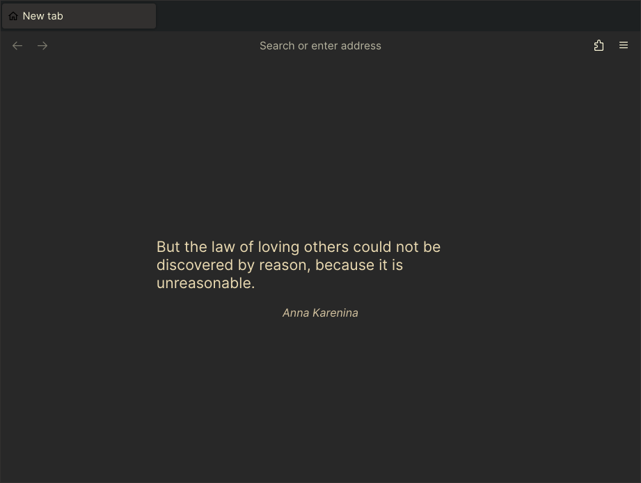

An html page with a quote in the middle. Every time the page opens or is reloaded the quote changes. That's it.



Setup

<details>
    <summary>Firefox</summary>
    <br>

> **NOTE**
> Firefox's installation location may vary. For example on a fresh Debian you should look for `/usr/lib/firefox-esr`.

In `/usr/lib/firefox/defaults/pref/autoconfig.js`

```javascript
pref("general.config.filename", "firefox.cfg");
pref("general.config.obscure_value", 0);
pref("general.config.sandbox_enabled", false);
```

In `/usr/lib/firefox/firefox.cfg`

```javascript
// First line must be a comment
var { classes: Cc, interfaces: Ci, utils: Cu } = Components;
try {
	Cu.import("resource:///modules/AboutNewTab.jsm");
	var newTabURL = "file:///path/to/NewTab/src/index.html"; // <- CHANGE THIS!
	AboutNewTab.newTabURL = newTabURL;
} catch (e) {
	Cu.reportError(e);
} // report errors in the Browser Console

// Auto focus new tab content
try {
	Cu.import("resource://gre/modules/Services.jsm");
	Cu.import("resource:///modules/BrowserWindowTracker.jsm");

	Services.obs.addObserver(() => {
		window = BrowserWindowTracker.getTopWindow();
		window.gBrowser.selectedBrowser.focus();
	}, "browser-open-newtab-start");
} catch (e) {
	Cu.reportError(e);
}
```

Then restart Firefox.
</details>

<details>
    <summary>Chromium</summary>

1. Go to `chrome://extensions`
2. Turn on "Developer mode" in the-top left corner
3. Finally click "Load unpacked" and select the root of the extension directory (in this case `src`).
</details>
